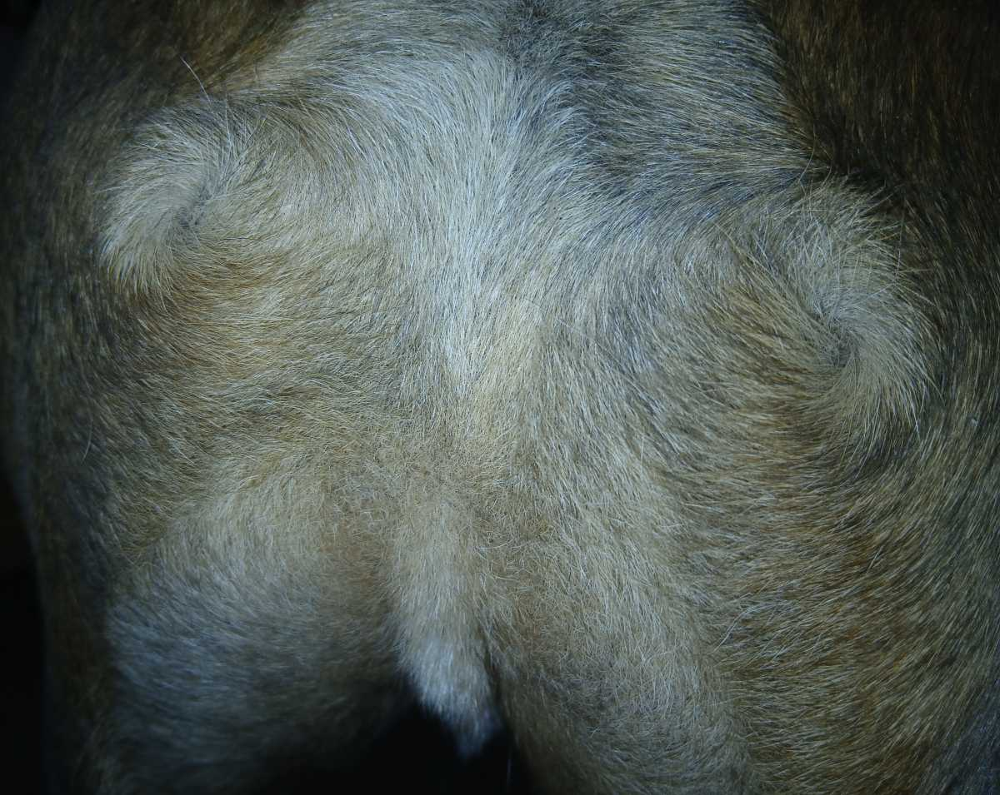
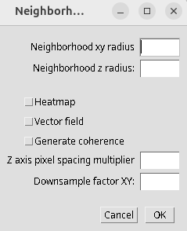
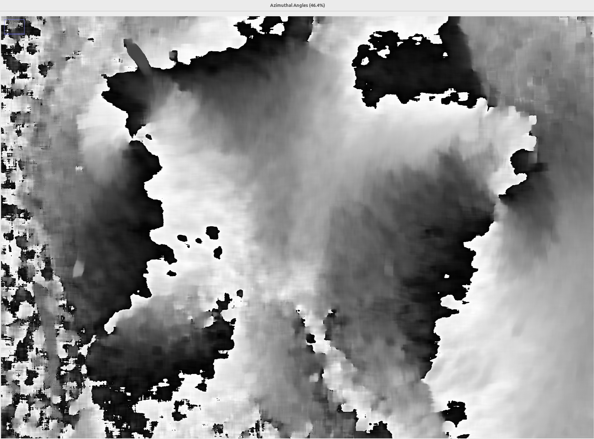
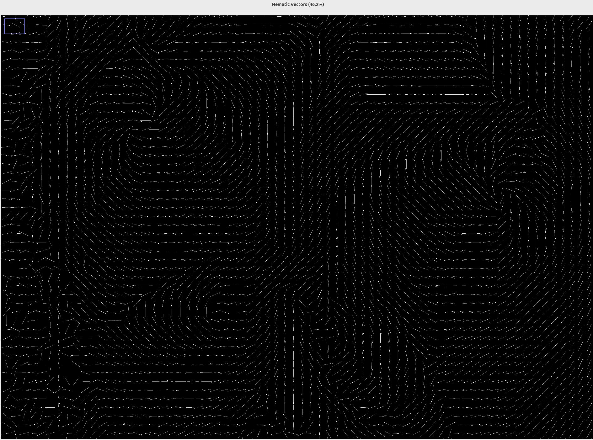
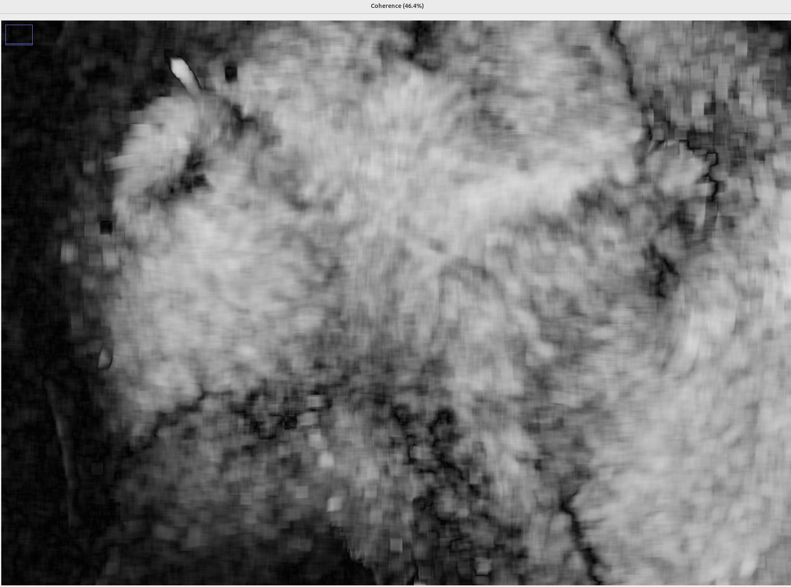
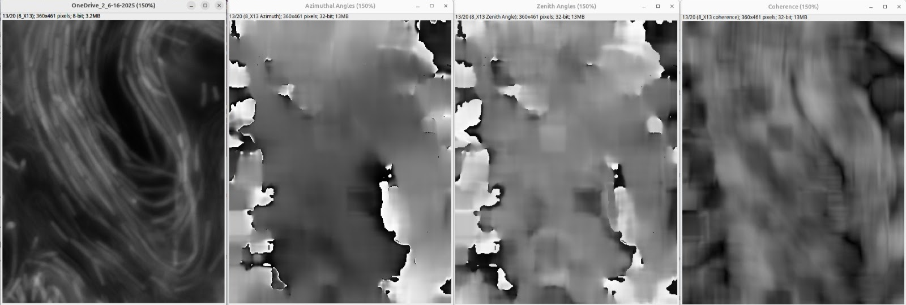
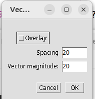
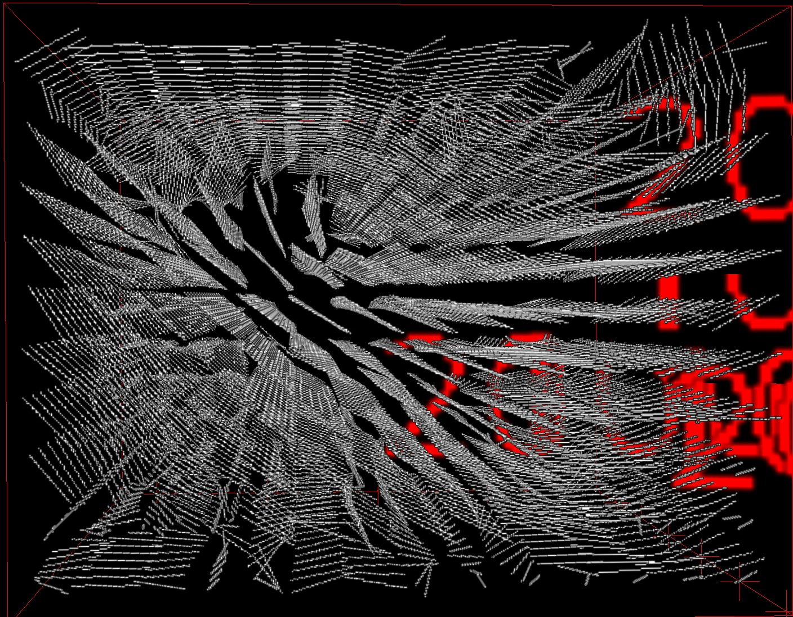
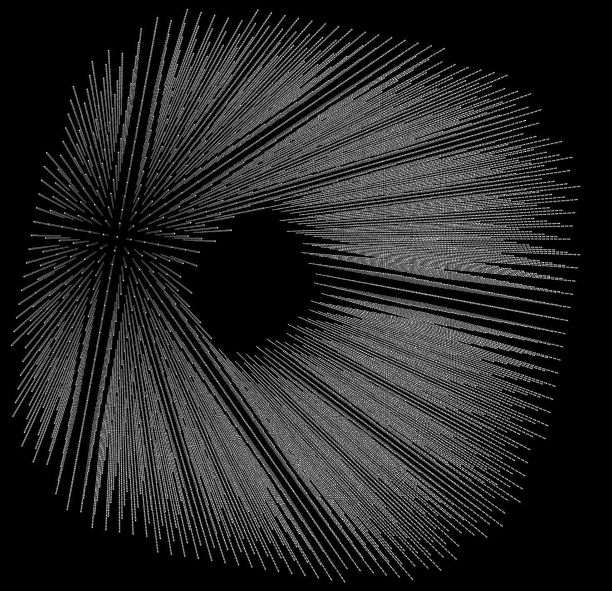
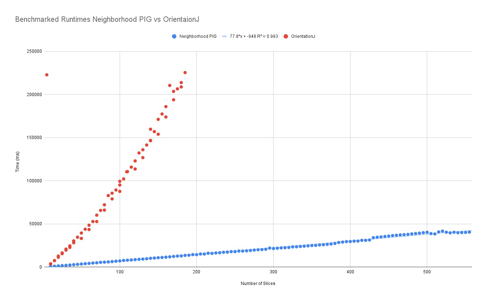

# Neighborhood PIG: A Fiji Plugin for Orientation Analysis

Neighborhood PIG (Pixel Intensity Gradient) is a Fiji plugin designed to analyze image orientation in two and three dimensions, offering a simplified approach similar to OrientationJ with a focus on core functionality. Unlike OrientationJ, Neighborhood PIG uses and requires a GPU. Future versions will hopefully be GPU optional.

This tutorial will guide you through its installation, usage, and interpretation of its outputs.

**Note:** For those unfamiliar with Fiji, it's a distribution of ImageJ, a powerful open-source image processing package. You can download Fiji from the official website: [https://imagej.net/software/fiji/](https://imagej.net/software/fiji/)

---
## Installation

To get started with Neighborhood PIG, follow these two simple steps:

### Step 1: Install the Neighborhood PIG Plugin

1.  Download the `NeighborhoodPIG.jar` file.
2.  Place the `NeighborhoodPIG.jar` file into the `plugins/` folder within your Fiji installation directory.

### Step 2: Install JCuda (Version 12 or Later)

Neighborhood PIG utilizes JCuda for GPU-accelerated computations. The plugin does not currently work without a GPU, though future versions will.

1.  Download the JCuda library (version 12 or later), including its native libraries. These `*.jar` files are available in the `JCuda12/` folder within this repository.
2.  Place all the downloaded JCuda `*.jar` files into the `jars/` folder within your Fiji installation directory.

**Prerequisite for JCuda:** For JCuda to function, you must have a **compatible NVIDIA GPU** and the **NVIDIA CUDA Toolkit (version 12.x or later)** installed on your system. You can download the CUDA Toolkit from the official NVIDIA Developer website: [https://developer.nvidia.com/cuda-downloads](https://developer.nvidia.com/cuda-downloads) Please ensure the CUDA Toolkit version you install is compatible with JCuda 12.

**Important:** If Fiji was open during the installation process, please restart it to ensure all new plugins and libraries are loaded correctly.

---
## Running Neighborhood PIG

### 1. Open an Image or Stack

Before launching the plugin, you must have an image or image stack open in Fiji.

* **To open an image:** Go to `File > Open...` and select your image file.
* **To open an image sequence or folder of images as a stack:** Go to `File > Import > Image Sequence...` or `File > Import > Image Stack...`

### 2. Convert Stack to Hyperstack (if applicable)

If you have opened a stack that represents multiple frames (e.g., time-lapse data) and it's not already a hyperstack, it's highly recommended to convert it. This ensures proper handling of multi-dimensional data.

* Go to `Image > Properties > Hyperstack...` (or `Image > Stacks > Make Hyperstack...` in older Fiji versions).
* In the "Make Hyperstack" dialog, ensure your dimensions (channels, slices, frames) are correctly assigned. Click "OK".



*Figure 0: A sample image.*

### 3. Select the Neighborhood PIG Plugin

Once your image or stack is ready:

* Navigate to `Plugins > Neighborhood PIG`.

---
## Plugin Options

Upon opening the Neighborhood PIG plugin, a dialog box will appear with several configuration options.



*Figure 1: The first options window.*

### Numerical Input Fields (Integer Values)

1.  **Neighborhood xy radius:**

    * **What this is:** When computing the orientation at a pixel, the structure tensor algorithm considers a square neighborhood surrounding that pixel. This value represents the shortest distance from the center of this neighborhood to the nearest edge in the XY plane.

    * **Example:** If you set this to `5`, the algorithm will analyze an `11 × 11` pixel neighborhood (center pixel + 5 pixels on each side) to compute the orientation of each pixel.

2.  **Neighborhood z radius:**

    * **What this is:** Similar to the XY radius, but for the Z (depth) dimension. This option is only visible if your image stack has a depth dimension (multiple Z-slices).
    * These two values together define the "neighborhood cube." Its volume is calculated as `( neighborhood xy × 2 + 1 )² × ( neighborhood z × 2 + 1 )`.

### Checkboxes

After the numeric fields, you'll find three checkboxes:

1.  **Heatmap:**

    * When checked, this option generates a grayscale heatmap representing the orientation in the picture. White pixels indicate an orientation of π radians, and black, 0 radians.

    * **Sample Output:**
        
        *Figure 2: Donut's Orientation Heatmap*

2.  **VectorField:**

    * When checked, this option creates a nematic vector field, visually representing the orientation of the stack. This is particularly useful for visualizing directional information.

    * **Sample Output:**
        
        *Figure 3: Donut's nematic vector field, illustrating the directional orientation.*

3.  **Generate Coherence:**

    * When checked, this option produces a heatmap specifically showing the coherence of the orientation. Coherence measures the degree to which the orientation is elliptical versus circular. A coherence of 0 indicates there is no measurable orientation. A coherence of 1 indicates there is a strong orientation, much like an ellipse with a high major axis length to minor axis length ratio.

    * **Sample Output:**
        
        *Figure 4: Donut's coherence heatmap.*

### More Numerical Input Fields

1.  **Z axis multiplier:**

    * **What this is:** This field accepts any floating-point value. It allows you to account for differences in pixel spacing between your XY plane and your Z-axis layers. If azimuth angles are coming out too close to 0 or π, then try modulating this.
    * **Example:** If the distance between pixels on different Z-layers is twice the distance between pixels on the same XY plane, enter `2`. If the Z-distance is half, enter `0.5`. This option is only visible if your image has a depth dimension.

2.  **Downsample Factor XY:**

    * **What this is:** This field accepts integer values. If you set this value to `3`, the results will be computed for every third pixel in both the X and Y dimensions. If you set it to `10`, it will be for every tenth pixel, and so on.
    * **Recommendations:**

        * **For a Heatmap:** You'll likely want to set this to `1` for full resolution, unless you are dealing with severe memory limitations.

        * **For a Vector Field (Overlay):** If you intend to superimpose the vector field onto your original image, a value greater than `1` is recommended to provide visual spacing between the vectors, making them easier to interpret.

        * **For a Vector Field (Standalone):** Even if not superimposed, downsampling can reduce the resulting image size, which can be very large otherwise.


*Figure 5: A slice of a 3D bacteria image (left) and the heatmaps it may generate.*

---
## Vector Field Specific Options (New Window)

If you have selected the "VectorField" checkbox and clicked "OK," a new window will appear with additional options for fine-tuning the vector field visualization.



*Figure 6: The dialog window for configuring vector field display options.*

1.  **Overlay:**

    * This checkbox will only appear if your image has a depth of `1` (i.e., a single 2D image).
    * If checked, the generated vector field will be directly overlaid on top of your original stack.

    * **Important:** If using this option, ensure that your "spacing" value (described next) is equal to your "Downsample Factor XY" for proper alignment.

2.  **Spacing XY:**

    * **What this is:** This integer value determines the amount of space between the centers of adjacent vectors in the XY plane.

    * **Recommendations:** This value should be greater than `1`. If vectors are too close, they can be difficult to read. If they are too far apart, the image may use up too much memory.

3.  **Spacing Z:**

    * **What this is:** This integer value determines the amount of space between the centers of adjacent vectors in the Z (depth) dimension. This option is only visible if your image stack has a depth dimension.

    * **Recommendations:** This value should be greater than `1`. Similar to XY spacing, proper Z spacing ensures readability of the 3D vector field.

4.  **Vector Magnitude:**

    * **What this is:** This integer value controls the visual length of the vectors in the generated field. Adjust this to make the vectors clearly visible without overwhelming the image.

*Figure 7: A zoomed-in overlay of Donut.*

---
## Viewing 3D Output

If your original image has depth and you've generated a 3D vector field, you'll likely want to use Fiji's built-in 3D Viewer plugin to explore the results effectively.

* After the Neighborhood PIG process completes, you can typically find the output image/stack in the main Fiji window.
* Go to `Plugins > 3D Viewer`.
* In the 3D Viewer window, you can rotate, zoom, and adjust rendering options to visualize your 3D data, including the vector field.

    * **Sample 3D Vector Field (in 3D Viewer):**
        
        *Figure 8: A 3D vector field, best viewed using Fiji's 3D Viewer plugin. The original images were of a 3D bacteria culture; see figure 5.*

    *Figure 9: A 3D vector field generated by a cylinder.*

---
## Comparison: Neighborhood PIG vs. OrientationJ

Neighborhood PIG offers significant advantages over the traditional OrientationJ plugin, particularly in terms of performance and dimensionality support.

As illustrated in Figure 10, Neighborhood PIG demonstrates considerably faster processing times when analyzing 2D images. This performance gain is largely due to its utilization of GPU acceleration, a key differentiator from OrientationJ, which relies solely on CPU processing.

Beyond speed, Neighborhood PIG extends its capabilities to the third dimension. While OrientationJ is limited to 2D image analysis, Neighborhood PIG can effectively compute orientation and generate vector fields for 3D image stacks, providing a more comprehensive tool for complex volumetric data.


*Figure 10: A plot comparing the runtime of OrientationJ and Neighborhood PIG for 2D images as a function of the number of images, demonstrating Neighborhood PIG's performance advantage.*

---
## Running Neighborhood PIG Programmatically (from Macros or Scripts)

Beyond interacting with the plugin through its graphical dialog boxes, Neighborhood PIG can also be called directly from ImageJ/Fiji macros or other scripts (e.g., Python, JavaScript) using a string of parameters. This is particularly useful for automating workflows or running batch analyses.

The plugin's `run()` method expects a single string argument containing all the necessary parameters, space-separated. Your `UserInput.fromStrings()` method is designed to parse this string.

### Understanding the Parameter String

The `run()` method uses the `UserInput.fromStrings()` method, which expects a space-separated string of values in a very specific order. The order and type of parameters depend on whether your image is 2D (single slice) or 3D (multiple slices).

**General Structure of the Parameter String:**

Parameters are ordered sequentially. If a parameter is "omitted," it means it is not included in the string at all, and the subsequent parameters shift their position.

---
### 📦 Full List of UserInput Parameters

Neighborhood PIG expects the following command-line arguments after the image path and depth. Their inclusion depends on the image dimensionality and selected features.

| Position | Parameter Name | Type | Description | Use When |
| :------- | :------------- | :--- | :---------- | :------- |
| 1 | `xy_radius` | `int` | Radius of the XY neighborhood (e.g., 10). | Always |
| 2 | `z_radius` | `int` | Radius in the Z-direction (e.g., 3). | Only if `depth > 1` |
| 3 | `z_axis_multiplier` | `float` | Relative spacing between Z-slices (e.g., 2.0 = Z spacing is twice XY spacing). | Only if `depth > 1` |
| 4 | `generate_heatmap` | `boolean` | Whether to generate a heatmap showing orientation. | Always |
| 5 | `generate_vector_field` | `boolean` | Whether to generate a nematic vector field. | Always |
| 6 | `generate_coherence` | `boolean` | Whether to generate a coherence heatmap. | Always |
| 7 | `save_raw_vectors` | `boolean` | Whether to save raw eigenvector data to a text file (`.txt`). This generates a file for each frame (e.g., `frame_0.txt`). | Always |
| 8 | `vector_field_spacing_xy` | `int` | Space between vectors in the XY plane. | If `generate_vector_field == true` |
| 9 | `vector_field_spacing_z` | `int` | Space between vectors in the Z-direction. | If `generate_vector_field == true` AND `depth > 1` |
| 10 | `vector_field_magnitude` | `int` | Length of the vectors. | If `generate_vector_field == true` |
| 11 | `overlay_vector_field` | `boolean` | Whether to overlay vectors on the original image (2D only). | If 2D and `generate_vector_field == true` |
| 12 | `downsample_factor_xy` | `int` | Downsample factor for all outputs. If overlay = true, must equal `vector_field_spacing_xy`. | Always |
| 13 | `downsample_factor_z` | `int` | Downsample factor for all outputs in Z-direction. | Only if `depth > 1` |

---
### Examples:

#### Example 1: 2D Image (Single Slice) - Generate Heatmap and Vector Field with Overlay

Let's say you have a 2D image (e.g., Figure 1: Donut). You want:
* `neighborhood_xy_radius`: 10
* `generate_heatmap`: true
* `generate_vector_field`: true
* `generate_coherence`: false
* `save_raw_vectors`: false
* `vector_field_spacing_xy`: 15
* `vector_field_magnitude`: 10
* `overlay_vector_field`: true (since it's a 2D image)
* `downsample_factor_xy`: This will be set to `vector_field_spacing_xy` (15) because `overlay_vector_field` is `true`.
* `downsample_factor_z`: 1 (implicitly for 2D images, or explicitly if needed for the general macro structure).

The string for `UserInput` would be:
`"10 true true false false 15 10 true 15 1"`

**Fiji Macro Example:**

```ijm
// Open your 2D image first
open("path/to/your/donut_image.tif");
run("Neighborhood PIG", "10 true true false false 15 10 true 15 1");