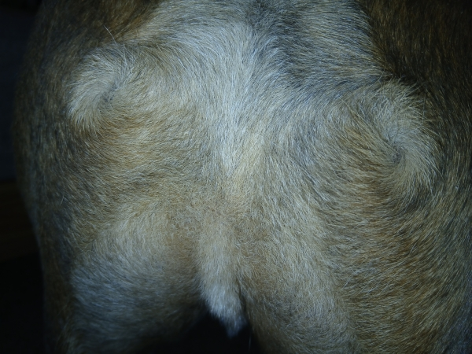

# Neighborhood PIG: A Fiji Plugin for Orientation Analysis

Neighborhood PIG (Pixel Intensity Gradient) is a Fiji plugin designed to analyze image orientation in two and three dimensions, offering a simplified approach similar to OrientationJ with a focus on core functionality. Unlike OrientationJ, Neighborhood PIG uses and requires a GPU. Future versions will hopefully be GPU optional.

This tutorial will guide you through its installation, usage, and interpretation of its outputs.

**Note:** For those unfamiliar with Fiji, it's a distribution of ImageJ, a powerful open-source image processing package. You can download Fiji from the official website: [https://imagej.net/software/fiji/](https://imagej.net/software/fiji/)

---
## Installation

To get started with Neighborhood PIG, follow these two simple steps:

### Step 1: Install the Neighborhood PIG Plugin

1.  Download the `NeighborhoodPIG.jar` file.
2.  Place the `NeighborhoodPIG.jar` file into the `plugins/` folder within your Fiji installation directory.

### Step 2: Install JCuda (Version 12 or Later)

Neighborhood PIG utilizes JCuda for GPU-accelerated computations. The plugin does not currently work without a GPU, though future versions will.

1.  Download the JCuda library (version 12 or later), including its native libraries. These `*.jar` files are available in the `JCuda12/` folder within this repository.
2.  Place all the downloaded JCuda `*.jar` files into the `jars/` folder within your Fiji installation directory.

**Prerequisite for JCuda:** For JCuda to function, you must have a **compatible NVIDIA GPU** and the **NVIDIA CUDA Toolkit (version 12.x or later)** installed on your system. You can download the CUDA Toolkit from the official NVIDIA Developer website: [https://developer.nvidia.com/cuda-downloads](https://developer.nvidia.com/cuda-downloads) Please ensure the CUDA Toolkit version you install is compatible with JCuda 12.

**Important:** If Fiji was open during the installation process, please restart it to ensure all new plugins and libraries are loaded correctly.

---
## Running Neighborhood PIG

### 1. Open an Image or Stack

Before launching the plugin, you must have an image or image stack open in Fiji.

* **To open an image:** Go to `File > Open...` and select your image file.
* **To open an image sequence or folder of images as a stack:** Go to `File > Import > Image Sequence...` or `File > Import > Image Stack...`

### 2. Convert Stack to Hyperstack (if applicable)

If you have opened a stack that represents multiple frames (e.g., time-lapse data) and it's not already a hyperstack, it's highly recommended to convert it. This ensures proper handling of multi-dimensional data.

* Go to `Image > Properties > Hyperstack...` (or `Image > Stacks > Make Hyperstack...` in older Fiji versions).
* In the "Make Hyperstack" dialog, ensure your dimensions (channels, slices, frames) are correctly assigned. Click "OK".

*Figure 0: A sample image.*

### 3. Select the Neighborhood PIG Plugin

Once your image or stack is ready:

* Navigate to `Plugins > Neighborhood PIG`.

---
## Plugin Options

Upon opening the Neighborhood PIG plugin, a dialog box will appear with several configuration options.

*Figure 1: The first options window.*

### Numerical Input Fields (Integer Values)

1.  **Neighborhood xy radius:**

    * **What this is:** When computing the orientation at a pixel, the structure tensor algorithm considers a square neighborhood surrounding that pixel. This value represents the shortest distance from the center of this neighborhood to the nearest edge in the XY plane.

    * **Example:** If you set this to `5`, the algorithm will analyze an `11 × 11` pixel neighborhood (center pixel + 5 pixels on each side) to compute the orientation of each pixel.

2.  **Neighborhood z radius:**

    * **What this is:** Similar to the XY radius, but for the Z (depth) dimension. This option is only visible if your image stack has a depth dimension (multiple Z-slices).
    * These two values together define the "neighborhood cube." Its volume is calculated as `( neighborhood xy × 2 + 1 )² × ( neighborhood z × 2 + 1 )`.

### Checkboxes

After the numeric fields, you'll find three checkboxes:

1.  **Heatmap:**

    * When checked, this option generates a grayscale heatmap representing the orientation in the picture. White pixels indicate an orientation of π radians, and black, 0 radians.

    * **Sample Output:**
        
        *Figure 2: Donut's Orientation Heatmap*

2.  **VectorField:**

    * When checked, this option creates a nematic vector field, visually representing the orientation of the stack. This is particularly useful for visualizing directional information.

    * **Sample Output:**
        
        *Figure 3: Donut's nematic vector field, illustrating the directional orientation.*

3.  **Generate Coherence:**

    * When checked, this option produces a heatmap specifically showing the coherence of the orientation. Coherence measures the degree to which the orientation is elliptical versus circular. A coherence of 0 indicates there is no measurable orientation. A coherence of 1 indicates there is a strong orientation, much like an ellipse with a high major axis length to minor axis length ratio.

    * **Sample Output:**
        
        *Figure 4: Donut's coherence heatmap.*

### More Numerical Input Fields

1.  **Z axis multiplier:**

    * **What this is:** This field accepts any floating-point value. It allows you to account for differences in pixel spacing between your XY plane and your Z-axis layers. If azimuth angles are coming out too close to 0 or π, then try modulating this.
    * **Example:** If the distance between pixels on different Z-layers is twice the distance between pixels on the same XY plane, enter `2`. If the Z-distance is half, enter `0.5`. This option is only visible if your image has a depth dimension.

2.  **Downsample Factor XY:**

    * **What this is:** This field accepts integer values. If you set this value to `3`, the results will be computed for every