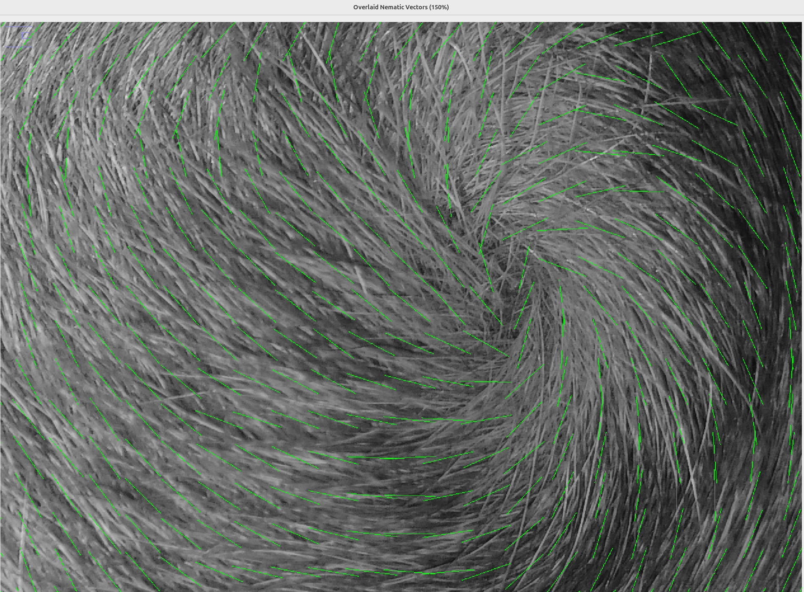

# Neighborhood PIG: A Fiji Plugin for Orientation Analysis

Neighborhood PIG (Pixel Intensity Gradient) is a Fiji plugin designed to analyze image orientation in two and three dimensions, offering a simplified approach similar to OrientationJ with a focus on core functionality. Unlike OrientationJ, Neighborhood PIG uses and requires a GPU. Future versions will hopefully be GPU optional.

This tutorial will guide you through its installation, usage, and interpretation of its outputs.

**Note:** For those unfamiliar with Fiji, it's a distribution of ImageJ, a powerful open-source image processing package. You can download Fiji from the official website: [https://imagej.net/software/fiji/](https://imagej.net/software/fiji/)

## Installation

To get started with Neighborhood PIG, follow these two simple steps:

### Step 1: Install the Neighborhood PIG Plugin

1. Download the `NeighborhoodPIG.jar` file.
2. Place the `NeighborhoodPIG.jar` file into the `plugins/` folder within your Fiji installation directory.

### Step 2: Install JCuda (Version 12 or Later)

Neighborhood PIG utilizes JCuda for GPU-accelerated computations.

1. Download the JCuda library (version 12 or later), including its native libraries. These `*.jar` files are available in the `JCuda 12/` folder within this repository.
2. Place all the downloaded JCuda `*.jar` files into the `jars/` folder within your Fiji installation directory.

**Prerequisite for JCuda:** For JCuda to function, you must have a **compatible NVIDIA GPU** and the **NVIDIA CUDA Toolkit (version 12.x or later)** installed on your system. You can download the CUDA Toolkit from the official NVIDIA Developer website: [https://developer.nvidia.com/cuda-downloads](https://developer.nvidia.com/cuda-downloads) Please ensure the CUDA Toolkit version you install is compatible with JCuda 12.

**Important:** If Fiji was open during the installation process, please restart it to ensure all new plugins and libraries are loaded correctly.

## Running Neighborhood PIG

### 1. Open an Image or Stack

Before launching the plugin, you must have an image or image stack open in Fiji.

* **To open an image:** Go to `File > Open...` and select your image file.
* **To open an image sequence or folder of images as a stack:** Go to `File > Import > Image Sequence...` or `File > Import > Image Stack...`

### 2. Convert Stack to Hyperstack (if applicable)

If you have opened a stack that represents multiple frames (e.g., time-lapse data) and it's not already a hyperstack, it's highly recommended to convert it. This ensures proper handling of multi-dimensional data.

* Go to `Image > Properties > Hyperstack...` (or `Image > Stacks > Make Hyperstack...` in older Fiji versions).
* In the "Make Hyperstack" dialog, ensure your dimensions (channels, slices, frames) are correctly assigned. Click "OK".


*Figure 0: A sample image.*

### 3. Select the Neighborhood PIG Plugin

Once your image or stack is ready:

* Navigate to `Plugins > Neighborhood PIG`.

---

## Plugin Options

Upon opening the Neighborhood PIG plugin, a dialog box will appear with several configuration options.


*Figure 1: For this tutorial, we'll start with a picture of Donut's derriere.*

### Numerical Input Fields (Integer Values)

1.  **Neighborhood xy radius:**

    * **What this is:** When computing the orientation at a pixel, the structure tensor algorithm considers a square neighborhood surrounding that pixel. This value represents the shortest distance from the center of this neighborhood to the nearest edge in the XY plane.

    * **Example:** If you set this to `5`, the algorithm will analyze an $11 \times 11$ pixel neighborhood (center pixel + 5 pixels on each side) to compute the orientation of each pixel.

2.  **Neighborhood z radius:**

    * **What this is:** Similar to the XY radius, but for the Z (depth) dimension. This option is only visible if your image stack has a depth dimension (multiple Z-slices).
    * These two values together define the "neighborhood cube." Its volume is calculated as $( \text{neighborhood xy} \times 2 + 1 )^2 \times ( \text{neighborhood z} \times 2 + 1 )$.

### Checkboxes

After the numeric fields, you'll find three checkboxes:

1.  **Heatmap:**

    * When checked, this option generates a grayscale heatmap representing the orientation in the picture. White pixels indicate an orientation of $\pi$ radians, and black, $0$ radians.

    * **Sample Output:**
        
        *Figure 2: Donut's Orientation Heatmap*

2.  **VectorField:**

    * When checked, this option creates a nematic vector field, visually representing the orientation of the stack. This is particularly useful for visualizing directional information.

    * **Sample Output:**
        
        *Figure 3: Donut's nematic vector field, illustrating the directional orientation.*

3.  **Generate Coherence:**

    * When checked, this option produces a heat map specifically showing the coherence of the orientation. Coherence measures the degree to which the orientation is elliptical versus circular. A coherence of $0$ indicates there is no measurable orientation. A coherence of $1$ indicates there is a strong orientation, much like an ellipse with a high major axis length to minor axis length ratio.

    * **Sample Output:**
        
        *Figure 4: Donut's coherence heat map.*

### More Numerical Input Fields

1.  **Z axis multiplier:**

    * **What this is:** This field accepts any floating-point value. It allows you to account for differences in pixel spacing between your XY plane and your Z-axis layers. If azimuth angles are coming out too close to $0$ or $\pi$, then try modulating this.
    * **Example:** If the distance between pixels on different Z-layers is twice the distance between pixels on the same XY plane, enter $2$. If the Z-distance is half, enter $0.5$. This option is only visible if your image has a depth dimension.

2.  **Downsample Factor XY:**

    * **What this is:** This field accepts integer values. If you set this value to $3$, the results will be computed for every third pixel in both the X and Y dimensions. If you set it to $10$, it will be for every tenth pixel, and so on.
    * **Recommendations:**

        * **For a Heatmap:** You'll likely want to set this to $1$ for full resolution, unless you are dealing with severe memory limitations.

        * **For a Vector Field (Overlay):** If you intend to superimpose the vector field onto your original image, a value greater than $1$ is recommended to provide visual spacing between the vectors, making them easier to interpret.

        * **For a Vector Field (Standalone):** Even if not superimposed, downsampling can reduce the resulting image size, which can be very large otherwise.


*Figure 5: A slice of a 3D bacteria image (left) and the heat maps it may generate.*

## Vector Field Specific Options (New Window)

If you have selected the "VectorField" checkbox and clicked "OK," a new window will appear with additional options for fine-tuning the vector field visualization.


*Figure 6: The dialog window for configuring vector field display options.*

1.  **Overlay:**

    * This checkbox will only appear if your image has a depth of `1` (i.e., a single 2D image).
    * If checked, the generated vector field will be directly overlaid on top of your original stack.

    * **Important:** If using this option, ensure that your "spacing" value (described next) is equal to your "Downsample Factor XY" for proper alignment.

2.  **Spacing:**

    * **What this is:** This integer value determines the amount of space between the centers of adjacent vectors. This spacing applies to both the Z-axis and the XY plane.

    * **Recommendations:** This value should be greater than `1`. If vectors are too close, they can be difficult to read. If they are too far apart, the image may use up too much memory.

3.  **Vector Magnitude:**

    * **What this is:** This integer value controls the visual length of the vectors in the generated field. Adjust this to make the vectors clearly visible without overwhelming the image.

*Figure 7: A zoomed-in overlay of Donut.*

## Viewing 3D Output

If your original image has depth and you've generated a 3D vector field, you'll likely want to use Fiji's built-in 3D Viewer plugin to explore the results effectively.

* After the Neighborhood PIG process completes, you can typically find the output image/stack in the main Fiji window.
* Go to `Plugins > 3D Viewer`.
* In the 3D Viewer window, you can rotate, zoom, and adjust rendering options to visualize your 3D data, including the vector field.

    * **Sample 3D Vector Field (in 3D Viewer):**
        
        *Figure 8: A 3D vector field, best viewed using Fiji's 3D Viewer plugin. The original images were of a 3D bacteria culture; see figure 5.*

    *Figure 9: A 3D vector field generated by a cylinder.*

## Running Neighborhood PIG Programmatically (from Macros or Scripts)

Beyond interacting with the plugin through its graphical dialog boxes, Neighborhood PIG can also be called directly from ImageJ/Fiji macros or other scripts (e.g., Python, JavaScript) using a string of parameters. This is particularly useful for automating workflows or running batch analyses.

The plugin's `run()` method expects a single string argument containing all the necessary parameters, space-separated. Your `UserInput.fromStrings()` method is designed to parse this string.

### Understanding the Parameter String

The `run()` method uses the `UserInput.fromStrings()` method, which expects a space-separated string of values in a very specific order. The order and type of parameters depend on whether your image is 2D (single slice) or 3D (multiple slices).

**General Structure of the Parameter String:**

Parameters are ordered sequentially. If a parameter is "omitted," it means it is not included in the string at all, and the subsequent parameters shift their position.

1.  **`[int] neighborhood_xy_radius`**: (e.g., `20`)
    * The XY radius of the neighborhood for structure tensor computation.
2.  **`[int] neighborhood_z_radius`**: (e.g., `5`)
    * **Conditional:** Only include if the image has a depth (Z-slices > 1). Omit if the image is 2D.
3.  **`[int] z_axis_pixel_spacing_multiplier`**: (e.g., `2`)
    * **Conditional:** Only include if the image has a depth (Z-slices > 1). Omit if the image is 2D.
4.  **`[boolean] generate_heatmap`**: (`true` or `false`)
    * Whether to generate a heatmap output.
5.  **`[boolean] generate_vector_field`**: (`true` or `false`)
    * Whether to generate a vector field output.
6.  **`[boolean] generate_coherence`**: (`true` or `false`)
    * Whether to generate coherence information.
7.  **`[int] vector_field_spacing`**: (e.g., `20`)
    * **Conditional:** Only include if `generate_vector_field` is `true`. Omit if `generate_vector_field` is `false`.
8.  **`[int] vector_field_magnitude`**: (e.g., `20`)
    * **Conditional:** Only include if `generate_vector_field` is `true`. Omit if `generate_vector_field` is `false`.
9.  **`[boolean] overlay_vector_field`**: (`true` or `false`)
    * **Conditional:** Only include if `generate_vector_field` is `true` AND the image is 2D (single slice). Omit if `generate_vector_field` is `false` or the image has multiple slices.
10. **`[int] downsample_factor_xy`**: (e.g., `1`)
    * **Conditional:** This parameter's value is taken from `vector_field_spacing` if `generate_vector_field` is `true` AND `overlay_vector_field` is `true`. Otherwise, it's parsed directly from the string. **You should always include this in the string as the last parameter.**

### Examples:

#### Example 1: 2D Image (Single Slice) - Generate Heatmap and Vector Field with Overlay

Let's say you have a 2D image (e.g., Figure 1: Donut's derriere). You want:
* `neighborhood_xy_radius`: 10
* `generate_heatmap`: true
* `generate_vector_field`: true
* `generate_coherence`: false
* `vector_field_spacing`: 15
* `vector_field_magnitude`: 10
* `overlay_vector_field`: true (since it's a 2D image)
* `downsample_factor_xy`: This will be set to `vector_field_spacing` (15) because `overlay_vector_field` is `true`.

The string would be:
`"10 false true false 15 10 true 15"`

**Fiji Macro Example:**

```ijm
// Open your 2D image first
open("path/to/your/donut_image.tif");
run("Neighborhood PIG", "10 false true false 15 10 true 15");
